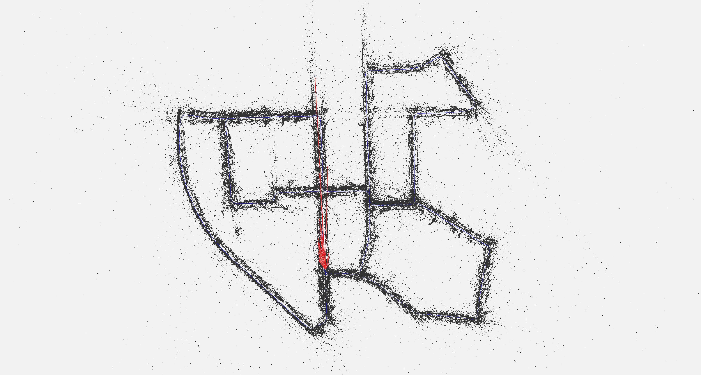
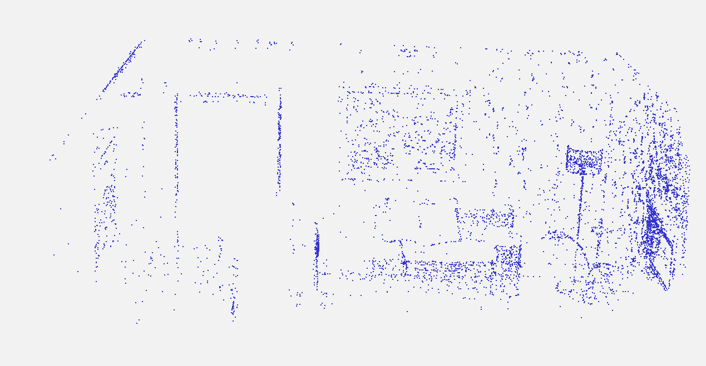

# Package `srrg2_proslam`

VO pipeline. Supports Stereo/RGB-D cameras. It uses the state-of-the-art VPR library [`srrg_hbst`](https://gitlab.com/srrg-software/srrg_hbst).

## How to build
The `srrg2_proslam` is developed using our `srrg2` framework.
All our software is tested both with Ubuntu 18.04 and 16.04 (GCC 5 and 7), still the remaining of this guide refers to Ubuntu 18.04.
Please follow this guide to build and run `srrg2_proslam` on your machine:

1. initialize the `srrg2` Catkin workspace following the guide [here](https://github.com/srrg-sapienza/srrg2_core/tree/master/srrg2_core). As indicated in the aforementioned guide, we suggest to have a directory in which you clone all the `srrg2` repositories (referred here as `SRRG2_SOURCE_ROOT`) and a directory that contains the Catkin workspace (referred here as `SRRG2_WS_ROOT`)

2. clone all the `srrg2` dependencies of this package
```bash
cd <SRRG2_SOURCE_ROOT>
git clone https://github.com/srrg-sapienza/srrg2_cmake_modules.git # basic cmake-modules
git clone https://gitlab.com/srrg-software/srrg_hbst.git # VPR library (to compute loop closures in Visual-SLAM pipelines)
git clone https://github.com/srrg-sapienza/srrg2_core.git # core data-structures and
git clone https://github.com/srrg-sapienza/srrg2_solver.git # solver (both for registration and global optimization)
git clone https://github.com/srrg-sapienza/srrg2_qgl_viewport.git # viewport
git clone https://github.com/srrg-sapienza/srrg2_slam_interfaces.git # SLAM interfaces
```

3. clone this repository
```bash
cd <SRRG2_SOURCE_ROOT>
git clone https://github.com/srrg-sapienza/srrg2_proslam.git
```

4. link all the required packages in your Catkin workspace
```bash
cd <SRRG2_WS_ROOT>/src
ln -s <SRRG2_SOURCE_ROOT>/srrg2_cmake_modules .
ln -s <SRRG2_SOURCE_ROOT>/srrg_hbst/ .
ln -s <SRRG2_SOURCE_ROOT>/srrg2_core/srrg2_core .
ln -s <SRRG2_SOURCE_ROOT>/srrg2_solver/srrg2_solver .
ln -s <SRRG2_SOURCE_ROOT>/srrg2_qgl_viewport/srrg2_qgl_viewport .
ln -s <SRRG2_SOURCE_ROOT>/srrg2_slam_interfaces/srrg2_slam_interfaces .
ln -s <SRRG2_SOURCE_ROOT>/srrg2_proslam/srrg2_proslam .
```

5. build using Catkin
```bash
cd <SRRG2_WS_ROOT>
catkin build srrg2_proslam
```

6. [OPTIONAL] build unit-tests using catkin
```bash
cd <SRRG2_WS_ROOT>
catkin build srrg2_proslam --catkin-make-args tests
```

## How to run
You should use our package [`srrg2_executor`](https://github.com/srrg-sapienza/srrg2_executor) to run the pipeline. In the [`configurations`](https://github.com/srrg-sapienza/srrg2_proslam/tree/master/configurations) directory you will find some template configuration files:

* [`kitti`](../configurations/kitti.conf): example [dataset](https://drive.google.com/open?id=1u_d4qp5p7eyWQk4zZhI8x13uEB_Ut7pC).
* [`euroc`](../configurations/euroc.conf): example [dataset](https://drive.google.com/open?id=1g6_QudgZetukSTe6MwYxauaei_8n_lza).
* [`malaga`](../configurations/malaga.conf) example [dataset](https://drive.google.com/open?id=1u_d4qp5p7eyWQk4zZhI8x13uEB_Ut7pC)
* [`icl`](../configurations/icl.conf) example [dataset](https://drive.google.com/open?id=1HBEmz0qBxFUTrk1K4pJIUNPpJYhgMHYD)
* [`tum`](../configurations/tum.conf) example [dataset](https://drive.google.com/open?id=1qPavF3iHuoeG7P_cVUUQ_nyXKE0miR-z)

###### Example Output (Stereo)


###### Example Output (RGB-D)

